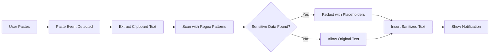

# 🛡️ PasteGuard - Chrome Extension

**Your Privacy Guardian for AI Conversations**

## Overview
PasteGuard is a privacy-focused Chrome extension that automatically detects and redacts sensitive information before you paste it into AI chatbots like ChatGPT, Claude, and Gemini. Protect your API keys, credit cards, emails, and other sensitive data with zero-configuration security.

## ✨ Key Features

### 🔒 Comprehensive Protection
Automatically detects and redacts **14 types** of sensitive data:
- 📧 **Email addresses**
- 🔑 **API Keys** (OpenAI, AWS, Google Cloud, Generic)
- 💳 **Credit card numbers** (Visa, Mastercard, Amex, Discover)
- 🔐 **Private keys** (RSA, EC, OpenSSH)
- 🎫 **JWT tokens**
- 🐙 **GitHub personal access tokens**
- 🌐 **IPv4 addresses** (with proper validation)
- 📱 **US phone numbers**
- 🆔 **Social Security Numbers**
- 🗄️ **Database connection strings**
- 🔑 **AWS Secret Access Keys**

### 🚀 Smart & Secure
- **100% Local Processing** - All scanning happens in your browser, no data leaves your machine
- **Real-time Detection** - Intercepts paste events before sensitive data reaches the AI
- **Visual Feedback** - Shows which types of data were redacted
- **Non-intrusive** - Only activates on supported AI platforms
- **Zero Configuration** - Works out of the box, no setup required

### 🎯 Supported Platforms
- ✅ ChatGPT (chatgpt.com)
- ✅ Claude (claude.ai)
- ✅ Gemini (gemini.google.com)

## 📥 Installation

### From Source (Developer Mode)
1. Clone or download this repository
2. Open Chrome and navigate to `chrome://extensions/`
3. Enable **"Developer mode"** (toggle in top-right corner)
4. Click **"Load unpacked"**
5. Select the `pasteguard` folder

### Verify Installation
- The PasteGuard icon should appear in your Chrome toolbar
- Click the icon to see the status popup
- Visit any supported AI platform and try pasting test data

## 🎮 How to Use

PasteGuard works automatically - no configuration needed!

1. **Copy** any text containing sensitive information
2. **Navigate** to ChatGPT, Claude, or Gemini
3. **Paste** into the chat input (Ctrl+V / Cmd+V)
4. **Watch** as PasteGuard automatically redacts sensitive data
5. **Review** the notification showing what was protected

### Example
**Before PasteGuard:**
```
My API key is sk-1234567890abcdef and my email is john@example.com
```

**After PasteGuard:**
```
My API key is [OPENAI_API_KEY_REDACTED] and my email is [EMAIL_REDACTED]
```

## 🔧 How It Works



1. **Paste Detection** - Listens for paste events on supported AI platforms
2. **Pattern Matching** - Scans clipboard content using regex patterns
3. **Redaction** - Replaces sensitive data with descriptive placeholders
4. **Safe Insertion** - Inserts sanitized text using multiple fallback methods
5. **Notification** - Shows which patterns were detected and redacted

## 🛠️ Development

### Project Structure
```
pasteguard/
├── manifest.json          # Extension configuration (Manifest V3)
├── icons/                 # Extension icons
│   ├── icon16.jpg
│   ├── icon48.jpg
│   └── icon128.jpg
└── src/
    ├── patterns.js        # Regex patterns for detection
    ├── content.js         # Main paste interception logic
    └── popup/
        ├── popup.html     # Extension popup UI
        ├── popup.css      # Popup styling
        └── popup.js       # Popup functionality
```

### Adding New Detection Patterns
Edit `src/patterns.js` and add a new pattern object:
```javascript
{
  name: "Pattern Name",
  regex: /your-regex-here/g,
  replacement: "[YOUR_PLACEHOLDER]"
}
```

### Testing
1. Use the included `TEST_DATA.txt` file or create your own test data
2. Copy the test data to clipboard
3. Open a supported AI platform (ChatGPT, Claude, or Gemini)
4. Paste and verify redaction works correctly
5. Check browser console (F12) for any errors or warnings

## 🔐 Privacy & Security

- ✅ **100% Local Processing** - No data is sent to external servers
- ✅ **No Analytics** - We don't track your usage or collect any data
- ✅ **Minimal Permissions** - Only requests necessary permissions
- ✅ **Open Source** - Code is fully auditable and transparent
- ✅ **No Third-party Dependencies** - Pure vanilla JavaScript

## ⚠️ Known Limitations

- Pattern detection is regex-based and may have false positives/negatives
- Some complex input fields may not support automatic text insertion
- AWS Secret Access Key pattern is broad and may catch other 40-char base64 strings
- Only works on explicitly listed domains (ChatGPT, Claude, Gemini)

## 🚀 Future Enhancements

- [ ] User-configurable patterns via settings page
- [ ] Enable/disable specific pattern types
- [ ] Statistics dashboard (items redacted over time)
- [ ] Whitelist for trusted sites
- [ ] Custom replacement text templates
- [ ] Support for more AI platforms (Perplexity, Poe, etc.)
- [ ] Export/import pattern configurations
- [ ] Dark mode for popup interface

## 🤝 Contributing

Contributions are welcome! Areas for improvement:
- **Pattern Accuracy** - More precise regex patterns with fewer false positives
- **Platform Support** - Add support for additional AI platforms
- **Compatibility** - Better text insertion methods for edge cases
- **UI/UX** - Enhanced popup interface and settings page
- **Performance** - Optimization for large paste operations

## 📄 License

MIT License - Feel free to use, modify, and distribute as needed.

## ⚠️ Disclaimer

PasteGuard provides a best-effort approach to detecting sensitive data using pattern matching. It should not be considered 100% foolproof. Always review what you're pasting into AI chatbots, especially in professional or high-security contexts.

**Remember**: The best security practice is to never paste truly sensitive data into any online service.

---

**Version**: 1.0  
**Last Updated**: February 2026  
**Made with ❤️ for Privacy**
